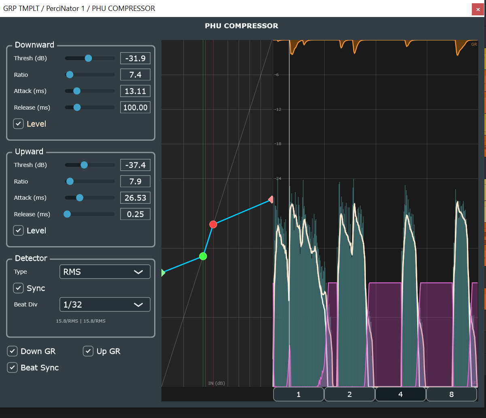

# PHU Compressor

[](https://github.com/huberp/phu-compressor/actions/workflows/build.yml)
[](https://github.com/huberp/phu-compressor/actions/workflows/release.yml)
[](LICENSE)
[](#building)
[](#building)
[](https://juce.com)
[](https://ko-fi.com/phuplugins)

A VST3 single-band OTT-style compressor combining upward and downward compression in a single plugin. An interactive transfer curve and a beat-synced rolling waveform display show both gain stages and their detector levels simultaneously, making it easy to see exactly what is happening to the dynamic range.



---

## Contents

- [Highlights](#highlights)
- [User Guide](#user-guide)
- [Building](#building)
- [Architecture](#architecture)
- [Contributing](#contributing)
- [License](#license)

---

## Highlights

🔼🔽 **Upward + downward compression in the classic OTT order** — the upward stage lifts quiet parts first; the downward stage then acts as a natural ceiling on the result. This makes the chain self-regulating: the downward compressor never over-clamps content that was already quiet, and the upward boost never pushes content above the downward threshold.

📐 **Interactive transfer curve** — large coloured handles on the transfer curve are draggable directly in the display. Moving a handle updates the corresponding threshold parameter in real-time. The combined (upward + downward) gain curve is drawn as a single continuous line so the interaction between both stages is always visible at a glance.

📊 **Beat-synced waveform display** — the right half of the panel renders input level, downward gain reduction, and upward boost as overlaid curves. In *Beat Sync* mode the display is anchored to the DAW's PPQ position so the waveform stays grid-aligned with the DAW transport regardless of display duration, BPM changes, or sample rate. In non-sync mode a classic scrolling waveform is shown instead.

🎛️ **Flexible detector** — each stage has its own detector feeding independent one-pole ballistics. The detector can operate in **RMS** (rolling window, O(1)) or **PeakMax** (rolling window max) mode. In BPM-sync mode the detector window is set as a musical fraction (1/32 to 4 beats) and tracks tempo changes automatically, so the compressor's response time stays musically consistent regardless of BPM.

🎚️ **Independent display toggles** — detector level curves (up/down) and gain-reduction overlays (up/down) can each be shown or hidden independently, keeping the display readable at any complexity level.

---

## User Guide

### Installation

1. Download the latest release from [Releases](https://github.com/huberp/phu-compressor/releases)
2. Copy the `.vst3` bundle to your DAW's VST3 folder:
   - Windows: `C:\Program Files\Common Files\VST3\`
   - Linux: `~/.vst3/` or `/usr/lib/vst3/`
3. Rescan plugins in your DAW
4. Load **PHU COMPRESSOR** on any track

No external dependencies — the binary is self-contained.

### Controls

**Downward group** — compresses signals that exceed the threshold

| Parameter | Range | Description |
|---|---|---|
| Thresh (dB) | −60 … 0 dB | Level above which downward compression engages. |
| Ratio | 1:1 … 20:1 | Compression ratio above threshold. |
| Attack (ms) | 0.1 … 500 ms | Time for gain reduction to fully engage after the threshold is crossed. |
| Release (ms) | 1 … 2000 ms | Time for gain reduction to recover after the signal falls back below threshold. |
| Level | toggle | Show/hide the downward detector curve in the display. |

**Upward group** — boosts signals that fall below the threshold

| Parameter | Range | Description |
|---|---|---|
| Thresh (dB) | −60 … 0 dB | Level below which upward compression (boost) engages. |
| Ratio | 1:1 … 20:1 | Upward expansion ratio below threshold. |
| Attack (ms) | 0.1 … 500 ms | Time for the boost to engage. |
| Release (ms) | 1 … 2000 ms | Time for the boost to release. |
| Level | toggle | Show/hide the upward detector curve in the display. |

**Detector group** — controls the level detector shared by both stages

| Parameter | Range | Description |
|---|---|---|
| Type | RMS / PeakMax | Sets the detection algorithm. RMS gives smooth, musical response; PeakMax reacts faster to transients. |
| Sync | toggle | When enabled, the detector window is set as a musical beat fraction that tracks BPM. When disabled, a manual millisecond window is used. |
| Beat Div | 1/32 … 4 | Beat fraction used as the detector window in Sync mode. 1/32 is fast (transient-accurate); 4 beats is very smooth. |
| RMS Window (ms) | 1 … 6000 ms | Manual detector window length (visible when Sync is off, RMS mode). |
| Peak Window (ms) | 1 … 6000 ms | Manual detector window length (visible when Sync is off, PeakMax mode). |

**Display toggles** (below the control panels)

| Toggle | Effect |
|---|---|
| Down GR | Show/hide the downward gain reduction overlay (orange, top of display). |
| Up GR | Show/hide the upward boost overlay (pink/magenta). |
| Beat Sync | Switch the waveform display between beat-anchored and scrolling modes. |

---

## Building

### Prerequisites

| Tool | Minimum version |
|---|---|
| CMake | 3.15 |
| C++ compiler | C++17 — MSVC 2022, GCC 11, or Clang 14 |
| JUCE | 8.0.12 (included as git submodule) |

### Clone

```bash
git clone https://github.com/huberp/phu-compressor.git
cd phu-compressor
git submodule update --init --recursive
```

### Windows

```bash
cmake --preset vs2026-x64
cmake --build --preset release
```

Output: `build/vs2026-x64/src/phu-compressor_artefacts/Release/VST3/`

### Linux

```bash
sudo bash scripts/install-linux-deps.sh
cmake --preset linux-release
cmake --build --preset linux-build
```

If the build times out: `cmake --build --preset linux-build -j2`

Output: `build/linux-release/src/phu-compressor_artefacts/VST3/`

For a full Linux dependency walkthrough see [docs/LINUX_BUILD.md](docs/LINUX_BUILD.md).

---

## Architecture

### Core Components

| Component | Location | Responsibility |
|---|---|---|
| `OttCompressor` | `src/OttCompressor.h` | Top-level compressor. Owns two `VolumeDetector`s and two `CompressorStage`s (one upward, one downward). Implements the classic OTT signal order: upward detection → upward boost → downward detection → downward compression. A fast peak-follower (5 ms decay) provides per-channel transient protection without per-sample carrier noise. |
| `CompressorStage` | `src/CompressorStage.h` | One compressor stage (downward or upward). Computes the target gain from the raw (unsmoothed) detector level, then smooths the gain envelope toward that target with separate one-pole attack and release coefficients. Gain ballistics operate on the *gain* domain, not the level domain, to prevent boost tails on transients from the upward stage. |
| `VolumeDetector` | `src/VolumeDetector.h` | Rolling-window level detector (RMS or PeakMax). RMS uses a running sum for O(1) per sample. PeakMax tracks the max in the window and rescans on eviction. The ring buffer is pre-allocated at `prepare()` to `kDetectorMaxWindowMs` samples — no allocation on the audio thread. |
| `CompressorDisplay` | `src/CompressorDisplay.h/cpp` | JUCE `Component` rendered at 60 Hz. Unified panel with: (1) a transfer curve with full-colour draggable threshold handles, (2) a rolling or beat-synced waveform showing input level and both GR overlays, and (3) a musical time selector. Pulls all data from lock-free FIFOs and `BeatSyncBuffer`s via `updateFromFifos()`. |
| `BeatSyncBuffer` | `lib/audio/BeatSyncBuffer.h` | Position-indexed overwrite buffer. Each bin maps to a normalised beat position `[0, 1)`. Audio-thread writes via `write(normalizedPos, value)`; UI-thread reads via `data()`. Single float stores are naturally atomic on x86/x64. |
| `AudioSampleFifo` | `lib/audio/AudioSampleFifo.h` | Lock-free SPSC FIFO for per-sample audio → UI transport. Used for input level and both gain-reduction streams. |
| `RmsPacketFifo` | `lib/audio/RmsPacketFifo.h` | Lock-free FIFO carrying batched, PPQ-anchored detector level packets. Allows the display to draw detector curves with musical time alignment. |
| `SyncGlobals` | `lib/events/SyncGlobals.h` | Holds current BPM, sample rate, and transport PPQ. Written on the audio thread; UI-thread reads `ppqEndOfBlock` via `std::atomic<double>`. |
| `PluginProcessor` | `src/PluginProcessor.h/cpp` | `AudioProcessor` + APVTS. Owns all DSP, FIFOs, and `BeatSyncBuffer`s. APVTS raw parameter pointers are cached at construction for lock-free audio-thread reads. |

### DSP Signal Path

```
processBlock  (audio thread)
  ├─ Read play-head: extract BPM, PPQ, isPlaying → SyncGlobals
  │
  ├─ Push raw input → InputFifo  (for UI input level curve)
  │
  ├─ For each sample (L + R independently):
  │    ├─ detectorUp.processSample(input)   → up level (dB)
  │    ├─ upStage.processSample(upLevelDb)  → upBoostGain  (≥ 1.0)
  │    ├─ intermediate = input × upBoostGain
  │    │
  │    ├─ detectorDown.processSample(intermediate) → down level (dB)
  │    └─ downStage.processSample(downLevelDb)     → downGain (≤ 1.0)
  │         └─ output = intermediate × downGain
  │
  ├─ Push downGain  → GainReductionFifo   (for UI down-GR curve)
  ├─ Push upBoost   → UpGainReductionFifo (for UI up-GR curve)
  ├─ Accumulate detector levels → RmsPacketFifo (PPQ-anchored, ~4-block batches)
  │
  └─ Write beat-sync buffers (PPQ → normalised pos → bin):
       ├─ m_inputSyncBuf.write(normPos, inputDb)
       ├─ m_grSyncBuf.write(normPos, downGrDb)
       └─ m_upGrSyncBuf.write(normPos, upBoostDb)

UI Timer  (60 Hz)
  ├─ updateFromFifos(): drain all FIFOs → internal ring buffers
  ├─ If beat-sync mode: snapshot BeatSyncBuffers directly
  ├─ Repaint transfer curve with current threshold handles
  └─ Repaint waveform with input, down-GR, up-GR, detector overlays
```

### Beat-Synced Detector Window

When **Sync** is enabled in the Detector group, the detector window length is computed as:

$$W_{ms} = \frac{60\,000}{\text{BPM}} \times \text{beatFraction}$$

The window is recomputed on every `processBlock` call using the current play-head BPM, so it tracks tempo automation without any user interaction. Supported fractions range from 1/32 (fast, ≈ 15 ms at 120 BPM) to 4 beats (slow, ≈ 2000 ms at 120 BPM).

### Project Layout

```
phu-compressor/
├── CMakeLists.txt / CMakePresets.json
├── docs/                            Screenshots and build guide
├── JUCE/                            JUCE 8.0.12 (git submodule)
├── src/
│   ├── PluginProcessor.h/cpp        processBlock, OTT compressor, FIFOs,
│   │                                BeatSyncBuffers, APVTS
│   ├── PluginEditor.h/cpp           UI layout, 60 Hz timer, APVTS attachments
│   ├── CompressorDisplay.h/cpp      Transfer curve + rolling/beat-sync waveform
│   ├── OttCompressor.h              Upward + downward compressor chain
│   ├── CompressorStage.h            One compressor stage (up or down)
│   ├── VolumeDetector.h             RMS / PeakMax rolling-window detector
│   ├── PluginConstants.h            Beat-division tables, buffer size constants
│   └── CMakeLists.txt
├── lib/
│   ├── audio/
│   │   ├── AudioSampleFifo.h        Lock-free SPSC FIFO (audio→UI)
│   │   ├── BeatSyncBuffer.h         Position-indexed overwrite buffer
│   │   ├── BucketSet.h              Dirty-tracked bucket partitioning
│   │   ├── RmsPacketFifo.h          PPQ-anchored detector level packets
│   │   ├── PpqRingBuffer.h          PPQ-indexed ring buffer helper
│   │   └── PacketFifo.h             Generic lock-free packet FIFO
│   └── events/
│       ├── SyncGlobals.h            BPM / PPQ / transport state
│       ├── SyncGlobalsListener.h    Event listener interface
│       └── Event.h / EventSource.h  Typed event infrastructure
├── .github/workflows/               CI build + pluginval + release workflows
└── scripts/
    ├── build.bat                    Windows convenience build script
    ├── release.bat                  Windows release packaging script
    └── install-linux-deps.sh        Installs JUCE Linux dependencies
```

---

## Contributing

Contributions are welcome.

1. Fork and branch from `main`
2. Follow existing C++17/JUCE code style
3. No memory allocation, system calls, or locks on the audio thread
4. Verify the project builds and passes pluginval before opening a PR

**Bug reports** — please include DAW name/version, OS, and reproduction steps in a [GitHub Issue](https://github.com/huberp/phu-compressor/issues).

---

## License

[MIT](LICENSE)
